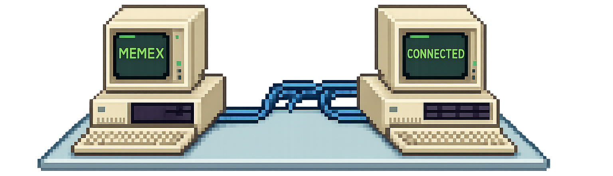

<div align="center">



<h1><code>memex</code></h1>

Manage [Agent Skills](https://agentskills.io) across harnesses — Claude Code,
Codex, pi — with symlinks from one git-versioned library.

[Install](#install) · [Usage](#usage) · [Configuration](#configuration) · [Contributing](#contributing)

---

</div>

Named after Vannevar Bush's [memex](https://en.wikipedia.org/wiki/Memex), the
original vision of linked knowledge.

Skills live in one place (`~/.memex/skills` by default) and are linked as
directory symlinks into the global skills directory of each harness. memex
only ever creates and removes symlinks that point into the library; it never
touches real directories or links it doesn't own.

## Install

```sh
curl -fsSL https://raw.githubusercontent.com/kocieusz/memex/main/install.sh | sh
```

That's it — no Go toolchain required. The script:

1. detects your OS and CPU (macOS and Linux, arm64 and amd64) and downloads the
   matching binary from the [latest release](https://github.com/kocieusz/memex/releases/latest);
2. verifies it against the release's `checksums.txt` before installing;
3. installs a single binary at `~/.memex/bin/memex`, keeping memex self-contained
   alongside its library (`~/.memex/skills`) and config (`~/.memex/config.toml`);
4. adds `~/.memex/bin` to your `PATH` by appending this to your shell startup
   file (`~/.zshrc` for zsh, `~/.bash_profile` / `~/.bashrc` for bash):

   ```sh
   # added by memex install.sh
   export PATH="/Users/you/.memex/bin:$PATH"
   ```

   Then open a new terminal (or `source` that file) so the change takes effect.

If another `memex` is found earlier on your `PATH` — typically a leftover
`~/go/bin/memex` from a previous `go install` — the script warns you and tells
you how to remove it, so the old copy can't shadow the new one.

**Options** (environment variables):

| Variable | Effect |
| --- | --- |
| `MEMEX_INSTALL_DIR=~/.local/bin` | Install to a different directory (e.g. one already on your `PATH`). |
| `MEMEX_VERSION=v0.3.0` | Install a specific release instead of the latest. |
| `MEMEX_NO_MODIFY_PATH=1` | Don't touch your shell startup file; just print the `PATH` line to add yourself. |

### Updating

```sh
memex upgrade            # download the latest release and replace this binary
memex upgrade --check    # just report whether a newer release is available
```

`upgrade` verifies the checksum and swaps the running binary in place with an
atomic rename — there's never a stale second copy left behind, and an
interrupted upgrade leaves the working binary untouched. Run it any time.

### Install from source

If you have Go 1.26+ and prefer to build it yourself (or you're on an OS/arch
without a prebuilt binary):

```sh
go install github.com/kocieusz/memex@latest
```

The binary lands in `$(go env GOPATH)/bin` (usually `~/go/bin`), which is **not
on your `PATH` by default** — add it if `memex` isn't found:

```sh
export PATH="$(go env GOPATH)/bin:$PATH"    # in ~/.zshrc
```

A `go install` build updates with `go install …@latest`, not `memex upgrade` —
the latter detects this case and points you back to the `go` command rather
than fighting the toolchain.

## Usage

Start a library by scaffolding a skill, pulling some from a repo, or adopting
one you already have:

```sh
memex touch my-skill                        # scaffold skills/my-skill/SKILL.md
memex clone anthropics/skills               # pick skills from a repo, copy them into the library
memex adopt ~/.agents/skills/some-skill     # move a real skill dir into the library, symlink back
```

Then run `memex` to pick a harness target (claude, codex, pi, agents) and get
an interactive checklist — space toggles a skill, enter applies:

```
  Target: ~/.claude/skills          Source: ~/.memex/skills (2 skills)

  ▸ [x] scoped-commits        linked
    [ ] weighted-decision     available

  ↑/↓ move · space toggle · a all · n none · / filter · enter apply · q quit
```

After applying (or backing out with `q`), you return to the picker, so
several harnesses can be updated in one session.

Inspect without the TUI:

```sh
memex ls                                    # your library, with each skill's origin repo
memex ls --target claude                    # linked/available/broken skills in a target
memex ls -a --target claude                 # also native dirs and foreign links
memex ls --target claude --json
```

Keep things healthy:

```sh
memex doctor --fix                          # remove broken links, report missing SKILL.md
```

`clone` shallow-clones the repo, finds every directory holding a `SKILL.md`,
and opens a checklist to pick the ones to copy; each row shows the skill's
path inside the repo, and `i` reveals its description. It also takes full
clone URLs and GitHub `/tree/<branch>[/dir]` links; `--branch` picks a branch
explicitly (needed for branch names containing `/`).

memex records where each copied skill came from — repo, path, and a content
hash — in `.origins.toml` next to the skills. Re-running `memex clone` on the
same repo shows unchanged skills as `up to date` and changed ones as
selectable updates, with a warning when you've edited your copy locally
(updating overwrites it). Skills that came from anywhere else can't be
selected; that includes skills copied before memex tracked origins — re-add
them once to start tracking.

## Configuration

The library defaults to `~/.memex/skills`. To keep it somewhere else — say, in
your dotfiles repo — point memex at it in `~/.memex/config.toml`:

```toml
library = "~/.dotfiles/skills"
```

Precedence, highest first: the `--source` flag, the `MEMEX_SOURCE` environment
variable, the config file, the default.

## Contributing

memex doesn't accept external pull requests — read
[CONTRIBUTING.md](CONTRIBUTING.md) before opening one. Bug reports and ideas
are very welcome as [issues](https://github.com/kocieusz/memex/issues).
